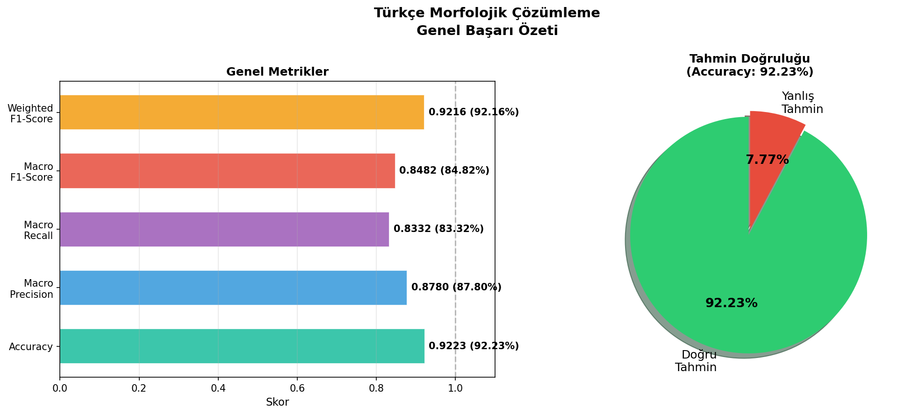
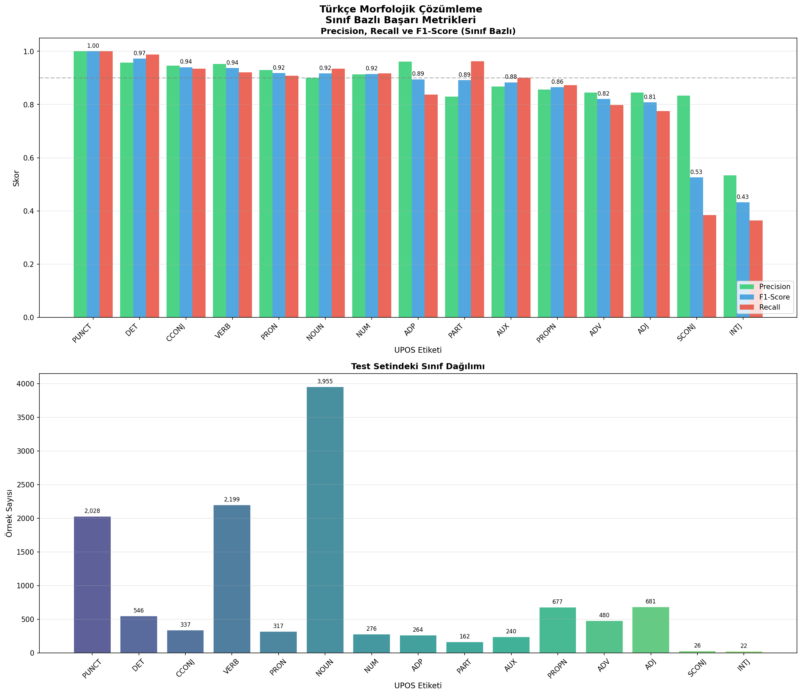
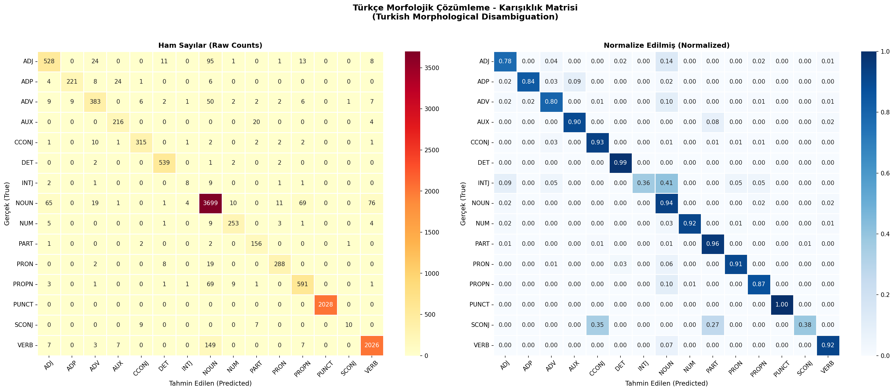

# 🇹🇷 Türkçe Morfolojik Çözümleme (Turkish POS Tagging & Morphological Disambiguation)
### Multinomial Logistic Regression & Zengin Özellik Mühendisliği ile UPOS Etiketleme

<div align="center">

[](https://www.python.org/)
[](https://scikit-learn.org/)
[](https://github.com)
[](https://github)

</div>

---

## 🎯 Proje İsterleri ve Gerçekleşme Durumu

Ders kapsamında talep edilen tüm isterler eksiksiz şekilde tamamlanmış ve test edilmiştir:

| İster Tanımı | Projedeki Karşılığı / Dosya | Durum |
| :--- | :--- | :---: |
| **1) İstatistiksel Makine Öğrenmesi** | [morphological_disambiguator.py](file:///d:/3_sinif_bahar_donemi/dogal%20dil%20islemeye%20giris/donem%20projesi/morphological_disambiguator.py) içerisinde **Multinomial Logistic Regression (SAGA solver)** kullanılmıştır. | ✅ |
| **2) CoNLL Formatında BIO İşaretleme** | [output/predictions_test.conllu](file:///d:/3_sinif_bahar_donemi/dogal%20dil%20islemeye%20giris/donem%20projesi/output/predictions_test.conllu) dosyasında her token `PredBIO=B-TAG` veya `PredBIO=I-TAG` şeklinde etiketlenmiştir. | ✅ |
| **3) Çalışır Eğitim ve Test Kodu** | [morphological_disambiguator.py](file:///d:/3_sinif_bahar_donemi/dogal%20dil%20islemeye%20giris/donem%20projesi/morphological_disambiguator.py) hem eğitimi hem de testi otomatik gerçekleştirir. | ✅ |
| **4) Değerlendirme Grafikleri ve Matris** | [output/](file:///d:/3_sinif_bahar_donemi/dogal%20dil%20islemeye%20giris/donem%20projesi/output/) dizininde doğruluk grafiği, sınıf bazlı metrikler ve Karışıklık Matrisi (Confusion Matrix) yer almaktadır. | ✅ |

---

## 🚀 Hızlı Başlangıç (Kurulum ve Çalıştırma)

### Gereksinimler
Projede kullanılan kütüphaneler: `numpy`, `pandas`, `scikit-learn`, `matplotlib`, `seaborn`, `tqdm`.

### Çalıştırma Adımları
1. **Bağımlılıkları Yükleyin:**
   ```bash
   pip install -r requirements.txt
   ```
2. **Projeyi Eğitin ve Test Edin:**
   ```bash
   python morphological_disambiguator.py
   ```
   *Windows kullanıyorsanız, doğrudan **`run_project.bat`** dosyasına çift tıklayarak tüm süreci başlatabilirsiniz.*

---

## 📊 Başarı Sonuçları ve Metrikler

**Test Seti Boyutu:** 12,210 Token (Turkish BOUN UD Treebank)

| Metrik | Değer |
| :--- | :---: |
| **Doğruluk (Accuracy)** | **%92.23** |
| **Ağırlıklı F1 (Weighted F1)** | **%92.16** |
| **Makro F1 (Macro F1)** | **%84.82** |
| **Makro Precision** | **%87.80** |
| **Makro Recall** | **%83.32** |

---

## 🖼️ Proje Görselleri ve Grafik Analizleri

### 1. Genel Başarı Özeti


### 2. Sınıf Bazlı Detaylı Başarı Dağılımı


### 3. Karışıklık Matrisi (Confusion Matrix)


---

## 🛠️ Detaylı Mimari ve Kod Analizi (Gelişmiş Bilgiler)

<details>
<summary>🔍 <b>1. Özellik Mühendisliği (Feature Engineering) Detayları (Tıklayıp Açınız)</b></summary>

Türkçe gibi sondan eklemeli dillerde kelime köküne gelen ekler sözcük türünü doğrudan belirler. Bu nedenle modelimize zengin morfolojik ve bağlamsal özellikler tanımlanmıştır:

* **Eksel Özellikler:**
  * `suffix_1` ila `suffix_5`: Kelimenin son 1, 2, 3, 4 ve 5 harfi (Türkçe eklerini yakalamak için).
  * `prefix_1` ila `prefix_3`: Kelimenin ilk 1, 2 ve 3 harfi.
* **Morfolojik İpuçları:**
  * Ünlü ve ünsüz harf sayıları (Türkçe büyük/küçük ünlü uyumları ve kelime yapısı için).
  * `-lık/-lik/-luk/-lük` eki kontrolü (`has_lik_suffix` -> isim yapma eğilimi).
  * `-la/-le` eki kontrolü (`has_la_suffix` -> zarf/fiil yapma eğilimi).
  * `-iyor` şimdiki zaman eki kontrolü (`has_progressive` -> fiil eğilimi).
  * `-mış/-miş` öğrenilen geçmiş zaman eki kontrolü (`has_past_nfh`).
  * `-dı/-di/-du/-dü` veya `-tı/-ti` görülen geçmiş zaman eki kontrolü (`has_past_fh`).
  * Kelimenin sayı olup olmadığı, büyük harfle başlayıp başlamadığı (`is_upper_start`), kesme işareti içerip içermediği (`has_apostrophe`) ve noktalama işareti olup olmadığı (`is_punct`).
* **Bağlamsal (Context) Özellikler:**
  * **Sol Bağlam:** Önceki kelimenin kendisi (`prev1_form`), son 2 harfi (`prev1_suffix2`), UPOS etiketi (`prev1_upos`) ve 2 önceki kelime bilgisi.
  * **Sağ Bağlam:** Sonraki kelimenin kendisi (`next1_form`), ilk 2 harfi (`next1_prefix2`), UPOS etiketi (`next1_upos`) ve 2 sonraki kelime bilgisi.
  * **Cümle Konumu:** Kelimenin cümle içindeki bağıl konumu (`position_ratio_cat`).

</details>

<details>
<summary>💻 <b>2. Kod Fonksiyonları ve Akış Şeması (Tıklayıp Açınız)</b></summary>

Projedeki ana fonksiyonlar ve görevleri şu şekildedir:

1. **`parse_conllu(filepath)`**: CoNLL-U formatındaki veri setini okur. Çoklu kelimeleri (multi-word token) filtreleyerek temizler ve cümle nesneleri oluşturur.
2. **`get_suffix_features(word)`** & **`get_morphological_clues(word)`**: Kelimeden morfolojik ve ek tabanlı özellikleri çıkarır.
3. **`extract_features(sentences)`**: Cümleler üzerinde kayan pencere (sliding window) yöntemiyle her kelime için bağlam özelliklerini birleştirerek büyük bir özellik matrisi oluşturur.
4. **`train_model(train_sentences)`**: Özellikleri `DictVectorizer` ile seyrek (sparse) matrise dönüştürür ve `scikit-learn` tabanlı `LogisticRegression` multinomial sınıflandırıcısını eğitir.
5. **`predict(...)`** & **`evaluate(...)`**: Test seti üzerinde tahmin yapar, F1, Precision, Recall ve Accuracy skorlarını sınıf bazlı hesaplar ve `output/classification_report.txt` olarak kaydeder.
6. **`plot_...(...)`**: Matplotlib ve Seaborn kütüphanelerini kullanarak değerlendirme grafiklerini oluşturur.
7. **`write_predictions_conllu(...)`**: Tahmin edilen etiketleri BIO şemasıyla standart CoNLL-U çıktısı olarak kaydeder.

</details>

<details>
<summary>📝 <b>3. CoNLL-U BIO Tahmin Çıktı Örneği (Tıklayıp Açınız)</b></summary>

İster 2 gereği, yapılan tüm tahminler CoNLL-U formatına uygun şekilde `output/predictions_test.conllu` dosyasına yazılmaktadır. Kelimelerin başladığı yerler **`B-[UPOS]`**, ardışık gelen aynı türler ise **`I-[UPOS]`** olarak etiketlenmiştir:

```conllu
# sent_id = boun_test_001
# text = Kitabı çok beğendim.
1   Kitabı    kitap   NOUN    _   Case=Acc      2   obj     _   PredBIO=B-NOUN
2   çok       çok     ADV     _   _             3   advmod  _   PredBIO=B-ADV
3   beğendim  beğen   VERB    _   Tense=Past    0   root    _   PredBIO=B-VERB
4   .         .       PUNCT   _   _             3   punct   _   PredBIO=B-PUNCT
```

</details>

<details>
<summary>📂 <b>4. Proje Dosya Dizini Ağacı (Tıklayıp Açınız)</b></summary>

```directory
📦 donem_projesi/
├── morphological_disambiguator.py    # Ana kaynak kodu (Eğitim, Test ve Çıktı Üretimi)
├── generate_report_pdf.py            # Raporu PDF formatına dönüştüren matplotlib scripti
├── run_project.bat                   # Projeyi tek tıkla kurup çalıştıran Windows scripti
├── rapor.html                        # Web tarayıcısında görüntülenebilen interaktif HTML raporu
├── Rapor_Morfolojik_Cozumleme.pdf    # Resmi teslim raporu (A4 formatında, 8 Sayfa)
├── requirements.txt                  # Python kütüphane bağımlılık listesi
├── tr_boun-ud-train.conllu           # BOUN Türkçe UD Eğitim Veri Seti
├── tr_boun-ud-test.conllu            # BOUN Türkçe UD Test Veri Seti
└── output/                           # Tüm çıktıların ve grafiklerin toplandığı dizin
    ├── confusion_matrix.png          # Karışıklık Matrisi Grafiği
    ├── metrics_per_class.png         # Sınıf Bazlı Detaylı Başarı Grafiği
    ├── overall_metrics.png           # Genel Başarı Metrikleri Grafiği
    ├── classification_report.txt     # Sınıf bazlı Precision, Recall, F1 metrik metin çıktısı
    └── predictions_test.conllu       # BIO formatında etiketlenmiş CoNLL-U test çıktısı
```

</details>

---

<div align="center">
<sub><b>NLP Dönem Projesi</b> · 2025–2026 Bahar Dönemi · Hazırlayan Öğrenciler Raporda Belirtilmiştir.</sub>
</div>
